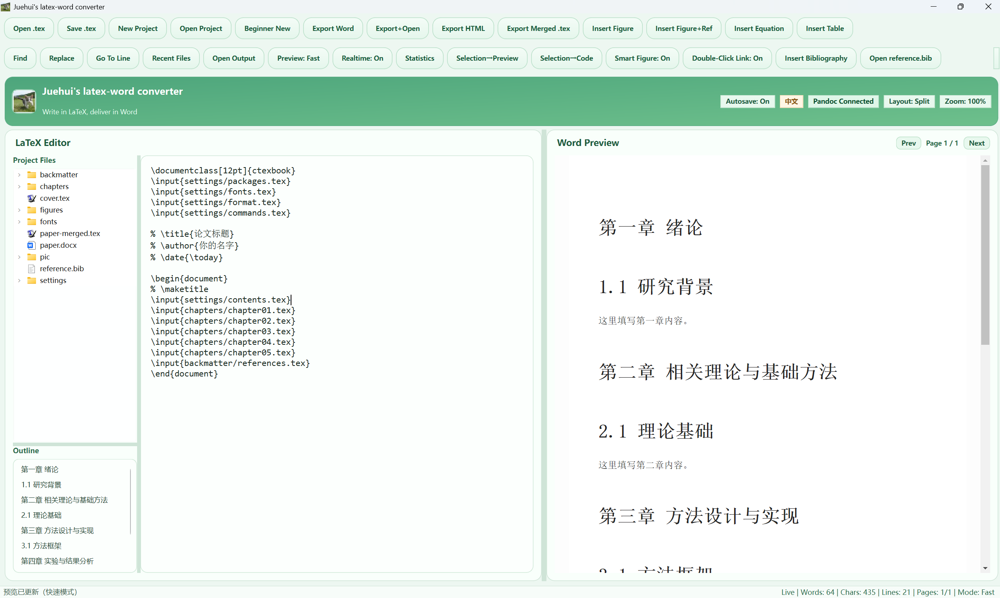

# Juehui's LaTeX-Word Converter  下载链接在下面附的网盘！！！！ 压缩包是软件解压以后能直接用 文件夹是工程源码 大家自己想要的功能和界面可自行DIY

A bilingual LaTeX-to-Word desktop editor with project-based workflow, live preview, and one-click `.docx` export.

## 软件界面 / UI Preview

  

## 中文简介
这是一个面向论文写作的 LaTeX 转 Word 桌面工具，支持：
- 多文件工程（chapter 分文件）
- 实时预览
- 公式、图片、参考文献
- 一键导出 `.docx`

## 快速使用 / Quick Start

### 中文
1. 解压压缩包。  
2. 双击 `JuehuiLatexWordConverter.exe` 启动。  
3. 点击“新建论文工程”或“打开工程目录”。  
4. 写作后点击“导出 Word”生成 `.docx`。  

### English
1. Unzip the package.  
2. Run `JuehuiLatexWordConverter.exe`.  
3. Click **New Project** or **Open Project**.  
4. Click **Export Word** to generate `.docx`.  

## 说明 / Notes
- 已内置运行环境与 Pandoc，无需安装 Python/Pandoc。  
  Runtime and Pandoc are bundled; no need to install Python/Pandoc.
- If Windows SmartScreen warns, click **More info** -> **Run anyway**.

## 下载 / Download
通过网盘分享的文件：latex-word
链接: https://pan.baidu.com/s/16zVMdRmOWZWEaVYtl-ntKQ 提取码: rzrw 
--来自百度网盘超级会员v1的分享
